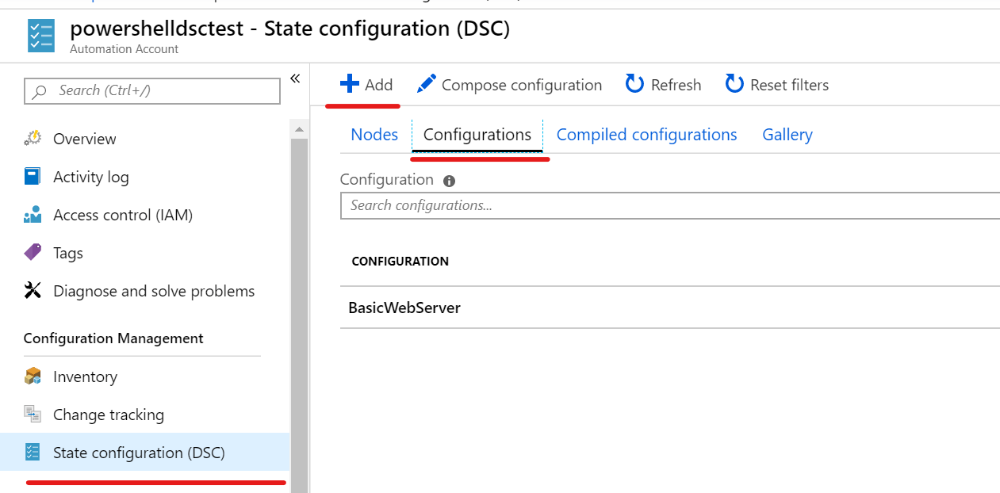

# Azure Automation

To use azure automation you need an `Azure Automation Account`. This resource is a PowerShell DSC pull server.
The cool thing about azure automation is that you have a marketplace of DSC configurations.

If you can't find a configuration for your requirements you can push your own configurations.

## Sample

Create a new azure automation account or use an existing one. In the list of tools on the left side of the Azure Automation UI you can find `State configuration (DSC)`.

Under `Configurations` you can add your own DSCs. (you can also use PowerShell commands for this, so you can automate with Azure DevOps)




After you have add a configuration you must compile it. For this you should use PowerShell. The UI in the portal can only compile configurations without configuration data.

The following to commands start the compilation. After this we the azure pull server has MOF files.

```powershell
# create configuration data
$dscData = @{
    AllNodes =
    @(
        @{
            NodeName    = 'testnode'
            Role = 'WebServer'
        }
    )
};
# Start the compilation in azure
Start-AzureRmAutomationDscCompilationJob -ResourceGroupName 'powershelldsc' -AutomationAccountName 'powershelldsctest' -ConfigurationName 'BasicWebServer' -ConfigurationData $dscData;
```

After this you can add nodes to your automation account and assign node configurations. After this your nodes will always be configured.

> Important: Azure Automation let the clients only allow to synchronize every 30 min. So you maybe have a little cap between updating a configuration and all nodes have the configuration applied.

You can monitor your node health under the `nodes` tab.
